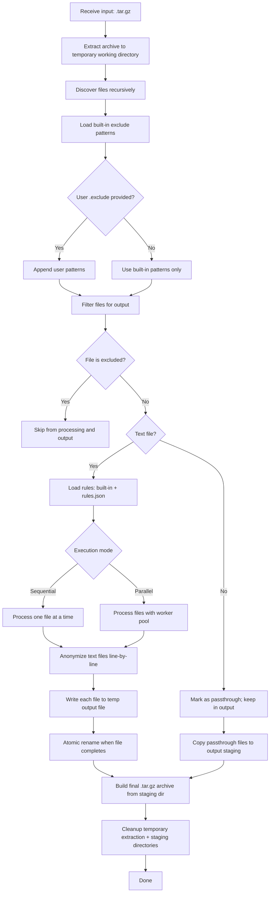
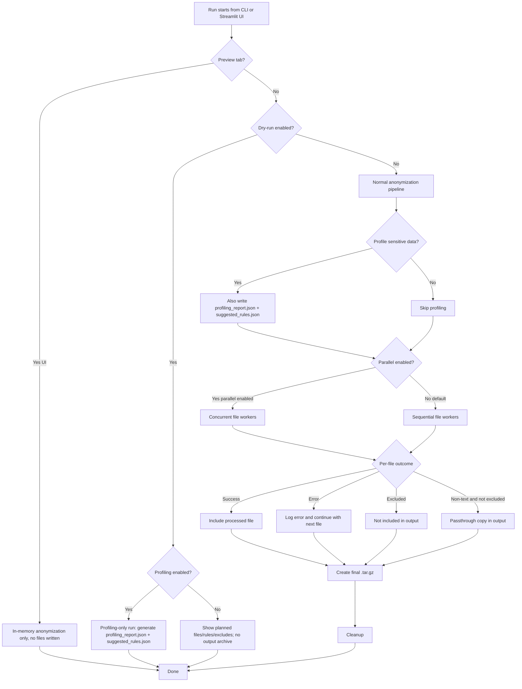
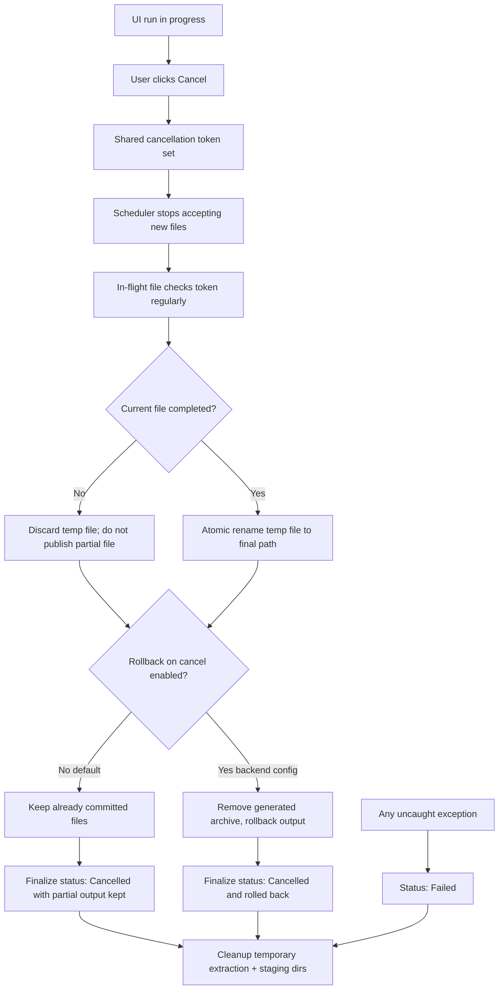

<p align="center">
  
</p>

<h1 align="center">Log Anonymizer</h1>

<p align="center">
  <a href="LICENSE"></a>
  
  
</p>

Production-ready CLI + Streamlit UI to redact/anonymize Hadoop ecosystem logs (HDFS, YARN, Hive, Spark, Impala, etc.) before sharing support bundles.

The project ships with a minimal set of built-in rules (IPs, Kerberos principals, common user/password key/value patterns) and lets you add your own rules and exclude patterns.

## Features

- Inputs: directory, single file, `.zip` archive, or `.tar.gz` archive
- Outputs: a single `.tar.gz` archive written inside the `--output` directory (preserves structure)
- `.exclude` support (glob patterns) to exclude sensitive/binary/large artifacts from both processing and output archive
- Built-in Hadoop-focused redaction rules + optional user-provided rules (`rules.json`)
- Optional parallel file processing (off by default; configurable max workers, default 5)
- Structured logging (JSON) at `INFO` by default (configurable)
- Streams large files line-by-line (memory efficient); never anonymizes non-text/binary files (but can include them in the output archive unless excluded)

## Install

```bash
python -m venv .venv
source .venv/bin/activate
pip install -r requirements.txt
pip install -e .
```

## Quick start (CLI)

```bash
log-anonymizer \
  --input tmp_test/in \
  --output tmp_test/out
```

Output:
- the tool generates `tmp_test/out/in.tar.gz` and prints its path

## Web UI (Streamlit)

Launch the web UI:

```bash
source .venv/bin/activate
streamlit run app.py
```

The UI exposes the same options as the CLI, plus:
- live logs
- download button for the resulting archive
- optional sensitive-data profiling (heuristic) + suggested rules download
- editable **Rules** and **Exclude** tabs (view/modify uploaded content interactively)
- **Preview anonymisation** tab to test anonymization on pasted log lines (no files written)
- **Cancel** button during execution (safe stop with consistent output state)
- If you enable profiling + dry-run, the UI runs profiling only (no archive) and lets you download the report and suggested rules.
- **Performance** controls: enable/disable parallel processing and configure max parallel workers (default 5; can be overridden via `$LOG_ANONYMIZER_WORKERS`).

In **Preview anonymisation**, paste a small log excerpt, click **Anonymiser**, and review the anonymized output immediately (in-memory; no output files are generated).

## Workflow diagrams (.tar.gz input)

This section explains the end-to-end pipeline used when the input is a `.tar.gz` support bundle.
Most stages are shared with directory and single-file inputs; the main difference is the extraction/preparation step.

### 1) High-level processing workflow



For `.zip`, directory, and single-file inputs, the same filtering/anonymization/output stages are reused; only input preparation differs.

### 2) Decision and optional behavior map



This diagram highlights optional branches that are already available in code and flags/options (`--dry-run`, profiling, parallel mode, UI preview).

### 3) Safe cancellation and output consistency



Cancellation is cooperative and safe: unfinished files are never partially written, completed files stay valid, and cleanup runs in all terminal states.

## Usage

### CLI examples

```bash
log-anonymizer --help
```

Anonymize a directory:

```bash
log-anonymizer \
  --input /path/to/logs \
  --output anonymized-out \
  --rules examples/rules.json \
  --exclude examples/.exclude
```

Anonymize a single file:

```bash
log-anonymizer \
  --input /path/to/hadoop.log \
  --output anonymized-out \
  --rules examples/rules.json
```

Anonymize a zip support bundle:

```bash
log-anonymizer \
  --input /path/to/support-bundle.zip \
  --output anonymized-out \
  --rules examples/rules.json \
  --exclude examples/.exclude
```

Anonymize a tar.gz support bundle:

```bash
log-anonymizer \
  --input /path/to/support-bundle.tar.gz \
  --output anonymized-out \
  --rules examples/rules.json \
  --exclude examples/.exclude
```

### Parallel processing (optional)

By default, the tool processes files **sequentially**. For large bundles, you can enable parallel processing:

```bash
# Parallel mode, default 5 workers
log-anonymizer --parallel --input /path/to/support-bundle.tar.gz --output anonymized-out
```

```bash
# Parallel mode with a custom limit
log-anonymizer --parallel --max-workers 3 --input /path/to/support-bundle.tar.gz --output anonymized-out
```

Notes:
- Parallelism applies to **independent files** (not to lines within a file).
- The output `.tar.gz` is still built in a single step (no concurrent writes to the archive).
- File ordering inside the output archive is kept deterministic (sorted by relative path).

### Dry-run

Preview which files will be processed, and how rules/exclude will be applied:

```bash
log-anonymizer \
  --input /path/to/support-bundle.zip \
  --output anonymized-out \
  --dry-run
```

### Optional sensitive-data profiling (heuristic)

You can optionally scan input text logs to detect *potential* sensitive data and generate rule suggestions.

This mode is **OFF by default** and does **not** change anonymization unless you apply the suggested rules.

```bash
log-anonymizer \
  --input /path/to/support-bundle.zip \
  --output anonymized-out \
  --profile-sensitive-data
```

Outputs (in addition to the archive):
- `anonymized-out/profiling_report.json`
- `anonymized-out/suggested_rules.json`

Profiling-only (no anonymization / no archive):

```bash
log-anonymizer \
  --input /path/to/support-bundle.zip \
  --output anonymized-out \
  --dry-run \
  --profile-sensitive-data
```

Optional flags:
- `--profiling-detectors email,ipv4,token,card`
- `--profiling-report /path/to/report.json`
- `--suggest-rules-output /path/to/suggested_rules.json`

## Configuration

Default logging configuration can be set via `log-anonymizer.ini` (or `--config`, or `$LOG_ANONYMIZER_CONFIG`):

```ini
[logging]
level = INFO
format = json
```

## Rules file (`rules.json`)

User rules are applied in addition to built-in rules. File format:

### Legacy format (v1)

```json
{
  "version": 1,
  "rules": [
    {
      "description": "Bearer token",
      "trigger": "Bearer ",
      "search": "(?i)\\bBearer\\s+\\S+\\b",
      "replace": "Bearer [REDACTED]",
      "caseSensitive": "false"
    }
  ]
}
```

Notes:
- `trigger` is an optional fast substring pre-check (rule runs only if the trigger is present in the line). If omitted/empty, the rule runs on every line.
- `search` is a Python regex, `replace` is passed to `re.sub`.
- `caseSensitive` defaults to `true` if omitted.

### Action format (v2)

Rules v2 keep the same top-level shape, but use an `action` object instead of `replace`.

```json
{
  "version": 2,
  "rules": [
    {
      "description": "Mask account number",
      "trigger": "acct=",
      "search": "(?<=\\bacct=)\\d{12,16}\\b",
      "caseSensitive": "true",
      "action": { "type": "mask", "maskChar": "*", "keepLast": 4 }
    }
  ]
}
```

Supported `action.type` values:

- `replacement`: fixed replacement (same as legacy `replace`)
  - fields: `value` (string)
- `redaction`: remove the match entirely
  - fields: none
- `mask`: mask fully/partially with a character
  - fields: `maskChar` (1 char, default `*`), `keepLast` (int), `keepFirst` (int)
- `secure_hash`: deterministic SHA-256 hash replacement
  - fields: `algorithm` (`sha256`), `salt` (optional), `length` (8–64), `prefix`, `suffix`
- `date_shift`: shift parsed dates by a deterministic number of days
  - fields: `formats` (array of `strptime` formats), `maxShiftDays` (0+), `salt` (optional), `group` (optional capture group)
- `bucket`: map numeric values into configured ranges
  - fields: `buckets` (array of `{min,max,label}`), `group` (optional capture group), `fallbackLabel`

Notes:
- A `version: 2` rules file may mix legacy rules (`replace`) and action rules (`action`) in the same `rules` array.
- Some actions support `group` to replace only a capturing group while keeping the rest of the match unchanged (useful for `age=23`).

Examples:

```json
{
  "description": "Fixed replacement (v2)",
  "trigger": "uuid=",
  "search": "\\buuid=[0-9a-fA-F-]{36}\\b",
  "action": { "type": "replacement", "value": "uuid=[UUID]" }
}
```

```json
{
  "description": "Hash email",
  "trigger": "@",
  "search": "\\b[A-Za-z0-9._%+-]+@[A-Za-z0-9.-]+\\.[A-Za-z]{2,}\\b",
  "action": { "type": "secure_hash", "algorithm": "sha256", "length": 16 }
}
```

```json
{
  "description": "Redact secret",
  "trigger": "secret=",
  "search": "secret=[^\\s]+",
  "action": { "type": "redaction" }
}
```

```json
{
  "description": "Mask full (PIN)",
  "trigger": "pin=",
  "search": "(?<=\\bpin=)\\d{4}\\b",
  "action": { "type": "mask", "maskChar": "*" }
}
```

```json
{
  "description": "Mask keep last 4 (account)",
  "trigger": "acct=",
  "search": "(?<=\\bacct=)\\d{12,16}\\b",
  "action": { "type": "mask", "maskChar": "*", "keepLast": 4 }
}
```

```json
{
  "description": "Bucket age",
  "trigger": "age=",
  "search": "\\bage=(\\d+)\\b",
  "action": {
    "type": "bucket",
    "group": 1,
    "fallbackLabel": "other",
    "buckets": [
      { "min": 0, "max": 17, "label": "0-17" },
      { "min": 18, "max": 29, "label": "18-29" },
      { "min": 30, "max": 49, "label": "30-49" },
      { "min": 50, "max": 200, "label": "50+" }
    ]
  }
}
```

```json
{
  "description": "Date shift (ISO date in key/value)",
  "trigger": "date=",
  "search": "\\bdate=(\\d{4}-\\d{2}-\\d{2})\\b",
  "action": {
    "type": "date_shift",
    "group": 1,
    "formats": ["%Y-%m-%d"],
    "maxShiftDays": 30
  }
}
```

Salt for deterministic actions:
- `secure_hash` and `date_shift` are deterministic for a given salt.
- You can set a per-rule salt (`action.salt`) or a global salt in `log-anonymizer.ini`:

```ini
[anonymization]
salt = your-stable-secret-salt
```

## `.exclude` format

The `.exclude` file is a line-based list of glob patterns.

- Blank lines and lines starting with `#` are ignored.
- Patterns are matched against the POSIX-style relative path (with `/` separators).
- Patterns starting with `!` negate (re-include) a previously excluded match.

### Built-in excludes (default)

Even without `--exclude`, the CLI excludes common credential/key material by default:

```
creds.localjceks
creds.localjceks.sha
*.jceks
*.jceks.sha
*.keytab
krb5.conf
jaas.conf
*.jks
*keystore*
*truststore*
*.p12
*.pfx
*.pem
*.key
*.crt
*.cer
*.der
*.kdb
```

If you pass `--exclude path/to/.exclude`, its patterns are appended after the built-ins (so your file can override defaults using `!`):

```
!**/krb5.conf
**/*.parquet
```

See `examples/.exclude`.

## Development

Run tests:

```bash
python -m venv .venv
source .venv/bin/activate
pip install -r requirements-dev.txt
pytest -q
```

## Notes

- Text files are anonymized; the tool attempts UTF-8 decoding first and falls back to Latin-1.
- Non-text/binary files are never anonymized; they are included as-is only if not excluded by built-in excludes or your `.exclude`.
- It streams line-by-line to handle large log files.

## License

Apache License 2.0. See `LICENSE`.
